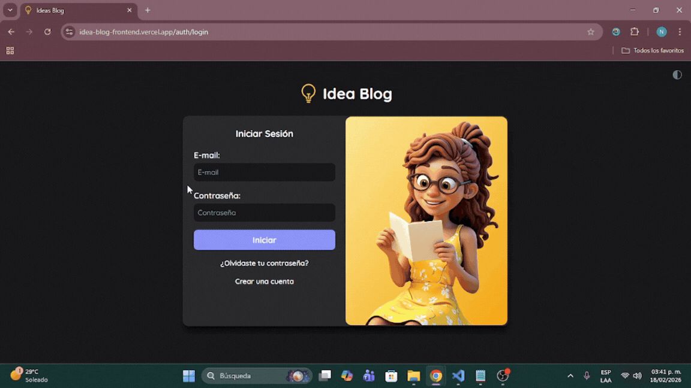
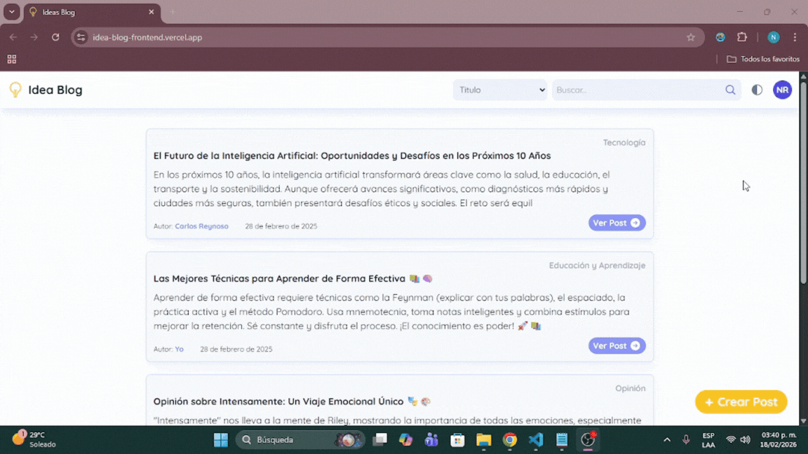
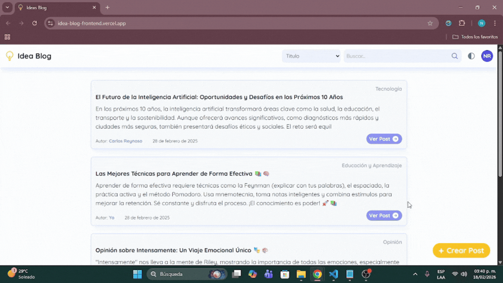
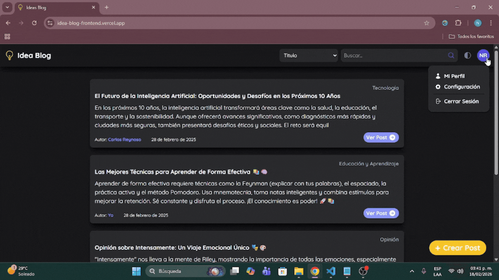

#  Idea Blog (frontend)

Frontend de **Idea Blog**, una aplicación de blog **fullstack** que permite a los usuarios registrarse, iniciar sesión y crear publicaciones organizadas por categorías.  
Este repositorio corresponde a la **interfaz de usuario**, que consume la API del backend.

🔗 Repositorio backend: https://github.com/rvnicole/idea-blog-frontend

---

### 🌐 Demo
https://idea-blog-frontend.vercel.app/

---

### ✨ Características
- 👤 Registro e inicio de sesión de usuarios
- 🗝️ Autenticación mediante tokens (JWT)
- 📝 Creación y visualización de posts
- 📚 Filtrado por categorías
- ✔️ Manejo de formularios con validación
- 🌎 Estado global de la aplicación

---

### ⚡​Stack tecnológico
- React
- TypeScript
- React Router DOM
- Axios
- Zustand
- React Hook Form
- Zod
- Tailwind CSS

---

### 🚀 Instalación
- npm install
- npm run dev

---

### 🔐 Environment Variables
- VITE_API_URL